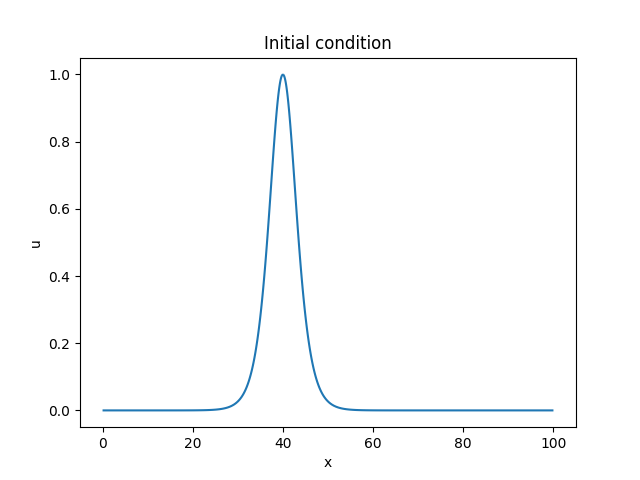
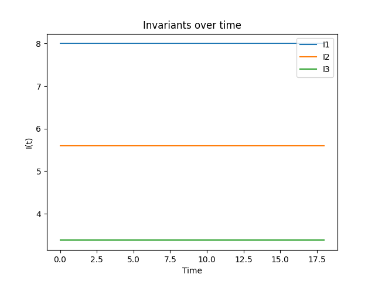
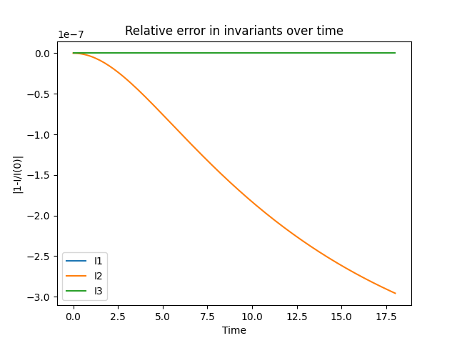
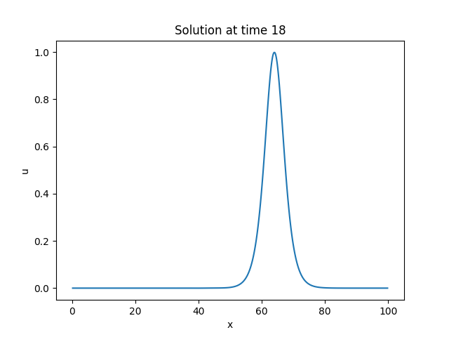

Hamiltonian-structure-preserving implementation of the Benjamin-Bona-Mahoney equation
=====================================================================================

This demo solves the Benjamin-Bona-Mahony equation:

.. math::

   u_t - u_{txx} + u_x + u u_x = 0

posed on a bounded interval with periodic boundaries.

BBM is known to have a Hamiltonian structure, and there are several canonical polynomial invariants:

.. math::

   I_1 & = \int u \, \mathrm{d}x

   I_2 & = \int u^2 + (u_x)^2 \, \mathrm{d}x

   I_3 & = \int \frac{u^2}{2} + \frac{u^3}{6} \, \mathrm{d}x

The BBM invariants are the total momentum :math:`I_1`, the :math:`H^1`-energy
norm :math:`I_2`, and the Hamiltonian :math:`I_3`.  
The Hamiltonian variational formulation reads

.. math::

   (\partial_t u + \partial_x \tilde{w}_H, v)_{H^1} & = 0

   (\tilde{w}_H, v_H)_{H^1} & = \langle \frac{\delta I_3}{\delta u}, v_H \rangle 

For all test functions :math:`v, v_H` in a suitable function space.
The numerical scheme in this demo introduces
the :math:`H^1`-Riesz representative of the Fréchet derivative of the
Hamiltonian :math:`\frac{\delta I_3}{\delta u}` 
as the auxiliary variable :math:`\tilde{w}_H`.

Standard Gauss-Legendre and continuous Petrov-Galerkin (cPG) methods conserve
the first two invariants exactly (up to roundoff and solver tolerances).  They
do quite well, but are inexact for the cubic one.  Here, we consider the
reformulation in Andrews and Farrell, "Enforcing conservation laws and dissipation
inequalities numerically via auxiliary variables" (`arXiv:2407.11904 <https://arxiv.org/abs/2407.11904>`_, to appear
in SIAM J. Scientific Computing) that preserves the third invariant at
the expense of the second.  This method has an auxiliary variable in the system
and requires a continuously differentiable spatial discretization (1D Hermite
elements in this case).  The time discretization puts the main unknown in a
continuous space and the auxiliary variable in a discontinuous one.  See
equation (7.17) of Boris Andrews' thesis for the particular formulation.

Firedrake, Irksome, and other imports::

  from firedrake import (Constant, Function, FunctionSpace,
      PeriodicIntervalMesh, SpatialCoordinate, TestFunction, TrialFunction,
      assemble, derivative, dx, errornorm, exp, grad, inner,
      interpolate, norm, plot, project, replace, solve, split
  )

  from irksome import Dt, GalerkinTimeStepper, TimeQuadratureLabel

  import matplotlib.pyplot as plt
  import numpy

Next, we define the domain and the exact solution ::

  N = 8000
  L = 100
  h = L / N
  msh = PeriodicIntervalMesh(N, L)
  x, = SpatialCoordinate(msh)

  t = Constant(0)
  inv_dt = N // (10 * L)
  tfinal = 18
  Nt = tfinal * inv_dt
  dt = Constant(tfinal / Nt)

  c = Constant(0.5)
  center = Constant(40.0)
  delta = -c * center

  def sech(x):
      return 2 / (exp(x) + exp(-x))
  
  uexact = 3 * c**2 / (1-c**2) \
      * sech(0.5 * (c * x - c * t / (1 - c ** 2) + delta))**2

This sets up the function space for the unknown :math:`u` and
auxiliary variable :math:`\tilde{w}_H`::

  space_deg = 3
  time_deg = 1

  V = FunctionSpace(msh, "Hermite", space_deg)
  Z = V * V

We next define the BBM invariants. Again, the discrete formulation preserves 
:math:`I_1` and :math:`I_3` up to solver tolerances and roundoff errors, 
but :math:`I_2` is preserved up to a bounded oscillation ::

  def h1inner(u, v):
      return inner(u, v) + inner(grad(u), grad(v))

  def I1(u):
      return u * dx

  def I2(u):
      return h1inner(u, u) * dx

  def I3(u):
      return (u**2 / 2 + u**3 / 6) * dx

We project the initial condition on :math:`u`, but we also need a consistent
initial condition for the auxiliary variable.  We need to find :math:`\tilde{w}_H \in V` such that

.. math::

   (\tilde{w}_H, v)_{H^1} = \langle \frac{\delta I_3}{\delta u}, v \rangle \text{ for all } v \in V

::

  uwH = Function(Z)
  u0, wH0 = uwH.subfunctions
  
  v = TestFunction(V)
  w = TrialFunction(V)
  a = h1inner(w, v) * dx
  dHdu = derivative(I3(u0), u0, v)

  solve(a == h1inner(uexact, v)*dx, u0)
  solve(a == dHdu, wH0)

Visualize the initial condition::

  fig, axes = plt.subplots(1)
  plot(Function(FunctionSpace(msh, "CG", 1)).interpolate(u0), axes=axes)
  axes.set_title("Initial condition")
  axes.set_xlabel("x")
  axes.set_ylabel("u")
  plt.savefig("bbm_init.png")

Create time quadrature labels::
  
  time_order_low = 2 * (time_deg - 1)
  time_order_high = 3 * time_deg - 1

  Llow = TimeQuadratureLabel(time_order_low)
  Lhigh = TimeQuadratureLabel(time_order_high)

This tags several of the terms with a low-order time integration scheme,
but forces a higher-order method on the nonlinear term::

  u, wH = split(uwH)
  v, vH = split(TestFunction(Z))

  Flow = h1inner(Dt(u) + wH.dx(0), v) * dx + h1inner(wH, vH) * dx
  Fhigh = replace(dHdu, {u0: u})

  F = Llow(Flow) - Lhigh(Fhigh(vH))

This sets up the cPG time stepper.  There are two fields in the unknown, we
indicate the second one is an auxiliary and hence to be discretized in the DG
test space instead by passing the `aux_indices` keyword::
            
  stepper = GalerkinTimeStepper(
      F, time_deg, t, dt, uwH, aux_indices=[1])

UFL expressions for the invariants, which we are going to track as we go
through time steps::

  times = [float(t)]
  functionals = (I1(u), I2(u), I3(u))
  invariants = [tuple(map(assemble, functionals))]

Do the time-stepping::

  for _ in range(Nt):
      stepper.advance()

      invariants.append(tuple(map(assemble, functionals)))

      i1, i2, i3 = invariants[-1]
      t.assign(float(t) + float(dt))
      times.append(float(t))

      print(f'{float(t):.15f}, {i1:.15f}, {i2:.15f}, {i3:.15f}')

Visualize invariant preservation::

  axes.clear()
  invariants = numpy.array(invariants)

  lbls = ("I1", "I2", "I3")

  for i in (0, 1, 2):
      plt.plot(times, invariants[:, i], label=lbls[i])
  axes.set_title("Invariants over time")
  axes.set_xlabel("Time")
  axes.set_ylabel("I(t)")
  axes.legend()
  plt.savefig("invariants.png")
  axes.clear()

  for i in (0, 1, 2):
      plt.plot(times, 1.0 - invariants[:, i]/invariants[0, i], label=lbls[i])
  axes.set_title("Relative error in invariants over time")
  axes.set_xlabel("Time")
  axes.set_ylabel("|1-I/I(0)|")  
  axes.legend()  
  plt.savefig("invariant_errors.png")

Visualize the solution at final time step::

  axes.clear()
  plot(Function(FunctionSpace(msh, "CG", 1)).interpolate(u0), axes=axes)
  axes.set_title(f"Solution at time {tfinal}")
  axes.set_xlabel("x")
  axes.set_ylabel("u")  
  plt.savefig("bbm_final.png") 

